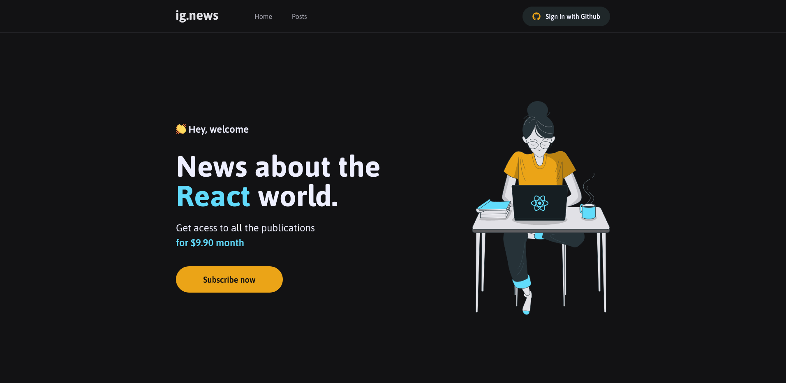
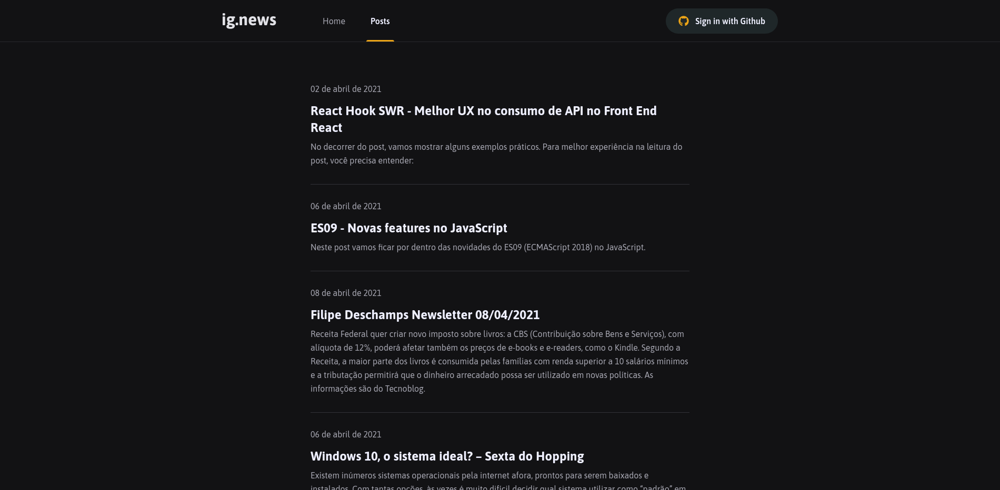
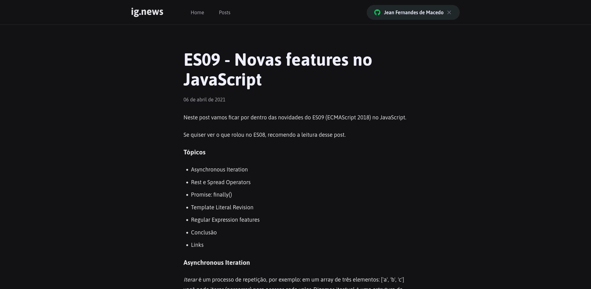

<h1 align="center">
	
</h1>

	
	
  

	
	
	

## Sobre

O projeto **Igews** é um blog que foi criado durante o curso **Ignite** da **Rocketseat** com o intuito de práticar.

## Tecnologias utilizadas

O projeto foi desenvolvido utilizando as seguintes tecnologias

- [TypeScript](https://www.typescriptlang.org/)
- [React](https://reactjs.org/)
- [Next.js](https://nextjs.org/)
- [Pismic](https://prismic.io/)

Desenvolvido por:

 
